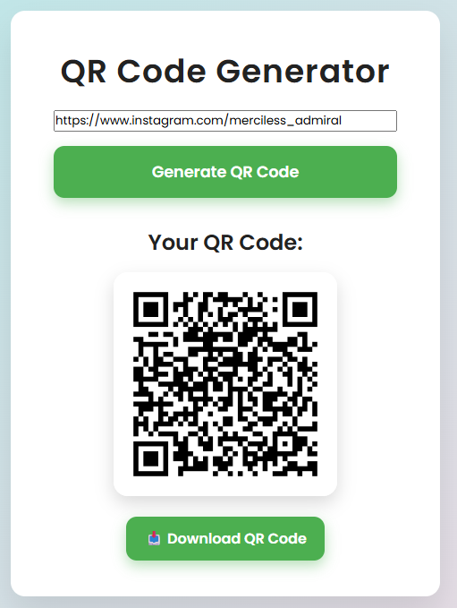

# QR Code Generator

A simple Flask web app to generate QR codes from URLs. Enter a URL, generate a QR code, and download the image.

## Features

- Generate QR codes for any URL
- Download the generated QR code as a PNG image
- Responsive, modern UI with light/dark mode toggle

## Screenshots



## Getting Started

### Prerequisites

- Python 3.7+
- pip

### Installation

1. Clone this repository:

   ```sh
   git clone https://github.com/merciless-admiral-3083/QR.git
   cd qr-code-generator
   ```

2. Install dependencies:

   ```sh
   pip install -r requirements.txt
   ```

### Running the App

```sh
python app.py
```

Open your browser and go [here](https://tinyurl.com/qr-by-jaspreet).

## Project Structure

```
app.py
requirements.txt
templates/
    index.html
static/
    qr.png
```

- `app.py`: Main Flask application
- `templates/index.html`: HTML template for the web UI
- `static/qr.png`: Generated QR code image

## Usage

1. Enter a valid URL (starting with http:// or https://).
2. Click "Generate QR Code".
3. Download the QR code image.

## License

MIT License
